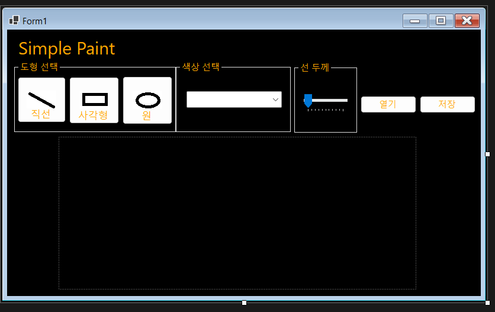
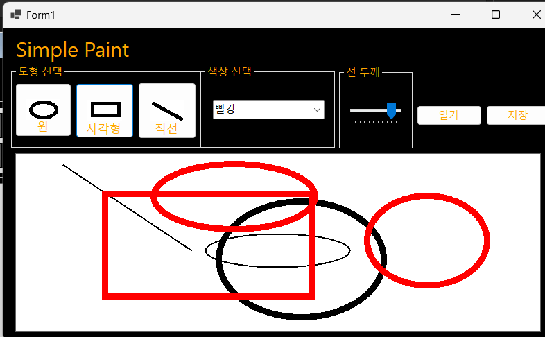
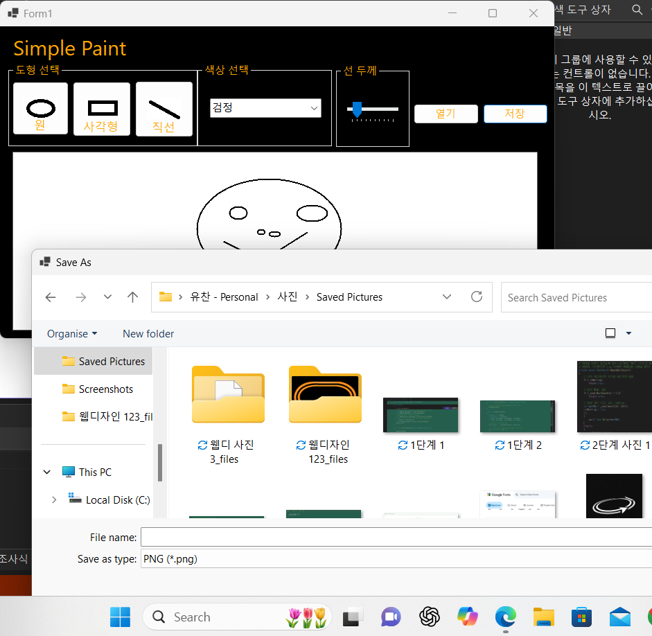
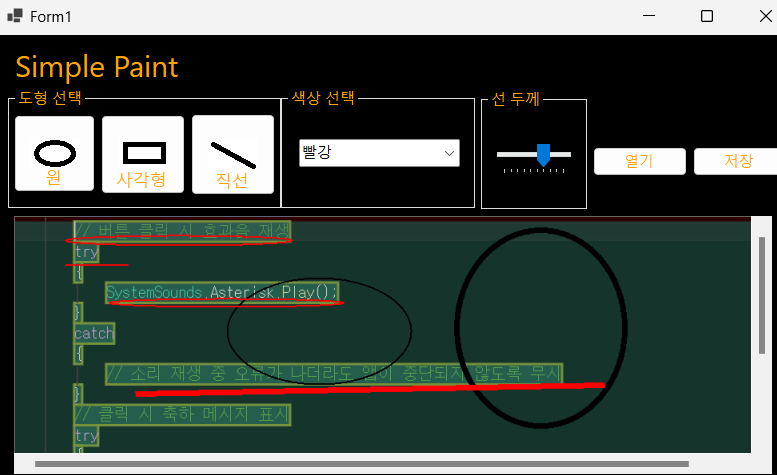

# SimplePaint
# (C# 코딩) SimplePaint 
## 개요
- C# 프로그래밍 학습
- 1줄 소개: C#을 이용한 간단한 페인트 프로그램
- 사용한 플랫폼: Windows Forms, C#, .NET 10.0, Visual Studio 2026, GitHub, GitHub Desktop
- 사용한 컨트롤: Panel, Button, 
- 사용한 기술과 구현한 기능
  - 마우스 이벤트 처리: 마우스 클릭, 드래그, 릴리즈 이벤트를 처리하여 그림을 그릴 수 있도록 구현
  - 색상 선택 기능: 다양한 색상을 선택할 수 있는 팔레트 구현
  - 선 굵기 조절 기능: 선의 굵기를 조절할 수 있는 슬라이더 또는 버튼 구현
  - 저장 및 불러오기 기능: 그린 그림을 파일로 저장하고, 저장된 파일을 불러올 수 있도록 구현
  

  ## 실행 화면 (과제1)
  -코드의 실행 스크린샷과 구현 내용설명

-구현한 내용: Label, TextBox, Button 컨트롤을 사용하여 UI를 설계하였다. 

## 실행 화면 (과제2)
-코드의 실행 스크린샷과 구현 내용 설명

-구현한 내용: Button 컨트롤을 사용하여 버튼 클릭 이벤트를 처리하였다. 
              마우스의 드래그를 사용하여 그림이 그려지도록 만들었다. 

## 실행화면 (과제3)

-코드의 실행 스크린샷과 구현 내용 설명

그려진 그림을 이미지 파을로 저장하는 기능을 구현하였다. 
파일 저장을 위한 대화상자인 SaveFileDialog를 사용하여 사용자가 저장할 위치와 파일 이름을 선택할 수 있도록 하였다.
3가지 포맷으로 저장할 수 있게 만들었다. (PNG, JPEG, BMP)

## 실행화면 (과제4)
-코드의 실행 스크린샷과 구현 내용 설명

